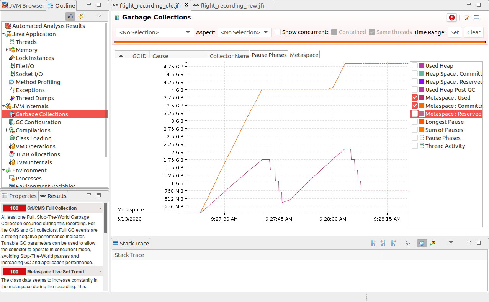
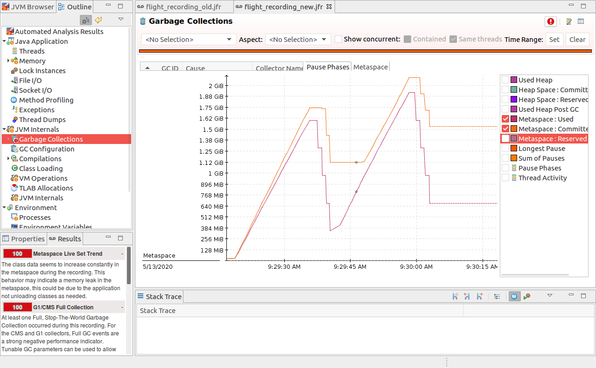

## Reduction of footprint due to jep 387 with many small grained loaders

Before:

After:

This is from an artificial test case involving tons of small grained class loaders. This is usually a pathological situation but may happen in the context of badly written user programs, dynamic languages, when lots of reflection proxies are generated etc.

